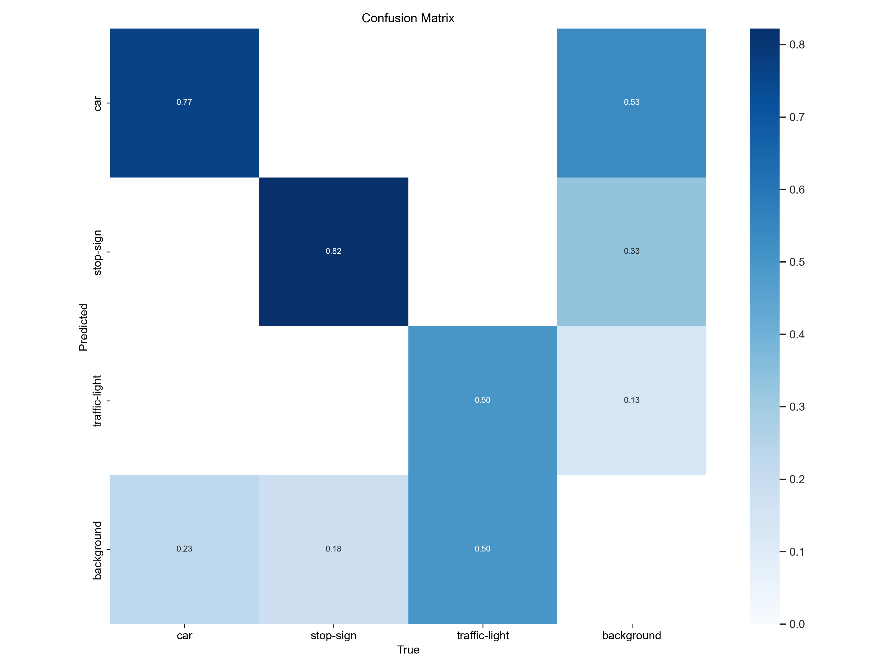
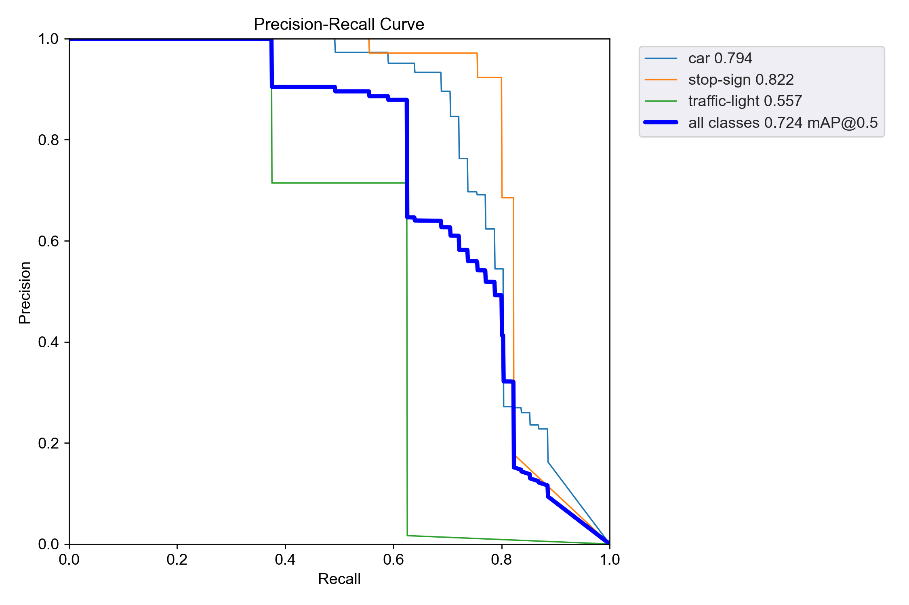

# CS5330_F24_Group8_Mini_Project_9

## project members

Anning Tian, Pingyi Xu, Qinhao Zhang, Xinmeng Wu

## setup instructions

Download the zip file or use GitHub Desktop to clone the file folder

Open the folder and run the python file --> 

``` python WebCamSave.py ```

WebCamSave.py is the name of the Python file

-f lane_test.mp4 specifies the input video file: lane_test.mp4 is a **Real Road Recording**, lane_test1.mp4, lane_test2.mp4 and lane_test3.mp4 are provided testing videos.

-o output.avi specifies the name of the output video file

## usage guide
's': Start the detection

'q': Exit the application

## description of the project
1. Frame Preprocessing and Color Filtering:
   - Convert the frame to HSV color space.
   - Apply color thresholding to isolate white and yellow colors, typically used for lane markings.
   - This step helps to focus on potential lane areas and reduce noise.

2. Edge Detection and Region of Interest:
   - Convert the color-filtered image to grayscale.
   - Apply Gaussian blur to reduce noise.
   - Use Canny Edge Detection algorithm to find edges in the image.
   - Define and apply a region of interest mask to focus on the road area.

3. black mask processing：
   - Create a trapezoid-shaped mask and applies it to the input image using bitwise operations, effectively blacking out everything outside the region of interest defined by the trapezoid.

4. Line Detection using Hough Transform:
   - Apply the Hough Transform algorithm to the edge-detected image.
   - The output is a set of line segments that potentially represent lane markings.

5. Line Filtering and Averaging:
   - Categorize detected lines into left and right lane lines based on their slope and position.
   - Calculate the average slope and intercept for each category (left and right).
   - This step uses concepts from linear regression to find the best representative line for each lane.

6. Line Extrapolation and Drawing:
   - Use the average slope and intercept to extrapolate full-length lines.
   - This step produces the visual output of the detected lanes.


## the link to the video demonstrating the application’s execution
https://drive.google.com/file/d/1hGRPit_ocD2FCuGKHZ1n_0lT_7oKM6H0/view?usp=sharing

### model evaluation metrics



